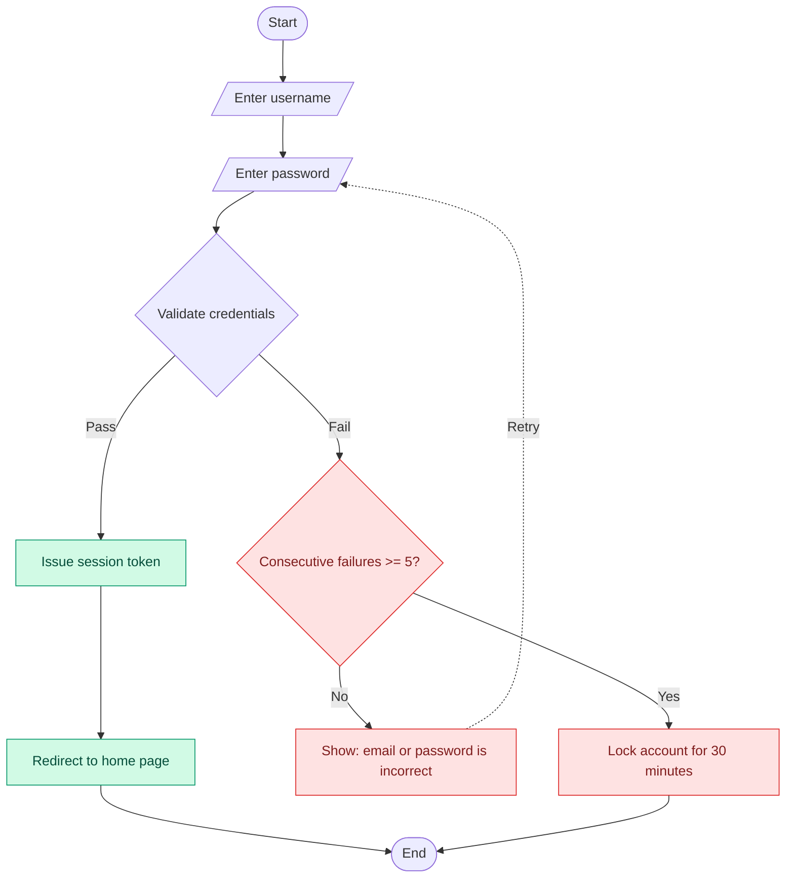

# Mermaid Diagrammer

The point of Mermaid is **diagrams as code**. The diagram lives in a text file, so it goes into Git, it can be reviewed, and it can be changed -- far better than a drag-and-drop image. The core deliverable is a single `.mmd` file.

## Decide the mode first

**Diagram mode** (default) -- the user described a process, system or state and wants a diagram. Produce the `.mmd` directly.

**Teaching mode** -- the user says "I'm new to this", "teach me", "step by step", "from scratch", "I want to learn Mermaid". Do not just drop a diagram. Follow the outline below: get a minimal runnable example working first, then layer on features, explaining at every step what the line is drawing.

When unsure, go with diagram mode -- if the user really wants to learn, they will ask follow-up questions once they see the result.

## Diagram mode

### Output conventions

- File name: `<topic>.mmd`, for example `login-flow.mmd`
- File contents: **the Mermaid code and nothing else** -- no ```mermaid fence, no filename comment line. The `.mmd` extension already declares the language.
- The first line must be a diagram-type declaration (`flowchart TD` / `sequenceDiagram` / `stateDiagram-v2`)
- Write labels in any language directly, but **whenever a label contains a space, bracket, comma, slash or colon, it must be quoted**: `A["Validate credentials (v2)"]`. This is the single most common source of syntax errors.

### Choosing the diagram type

Choosing the wrong type hurts more than a syntax error -- a syntax error gets reported by the renderer, whereas a wrong diagram type is only discovered once the user looks at the result.

- **Process / decision / branching** -> `flowchart TD` (top-down) or `LR` (left-right; good for long chains)
- **Back-and-forth interaction between two parties** -> `sequenceDiagram`
- **State transitions of a single object** -> `stateDiagram-v2`
- **Who owns what at which stage (swimlanes)** -> `flowchart` + `subgraph`
- **Phases laid out on a timeline** -> `gantt`

### Flowchart skeleton (with a loop)

Mermaid flowcharts have **no native loop syntax**. Loops are expressed with a **back edge** -- an arrow pointing back upstream, which the renderer lays out as a cycle. Do not go looking for a `loop` keyword; there is not one.



Common shapes:

| Syntax | Renders as | Best for |
|---|---|---|
| `A[text]` | rectangle | ordinary step |
| `A([text])` | rounded capsule | start / end |
| `A{text}` | diamond | decision |
| `A[/text/]` | parallelogram | input / output |
| `A[(text)]` | cylinder | data store |
| `A[[text]]` | double border | subprocess |

### Advanced features at a glance

- **Back edge for loops**: `H -.Retry.-> C`. A dashed arrow separates the normal flow from the return flow, which reads more easily.
- **Grouping (swimlanes)**: `subgraph Frontend` ... `end`. Note that `end` is reserved and **cannot be used as a node ID**.
- **Styling**: `classDef` defines a style class and `class nodeId className` applies it in bulk. Far easier to maintain than per-node `style` statements.
- **Link styling**: `linkStyle 3 stroke:#dc2626,stroke-width:2px` -- the argument is the **index** of the link, counting from 0. Re-check the indices whenever the diagram changes; this is an easy trap.
- **Comments**: `%% this is a comment`. Document the business meaning of each branch for whoever comes next.
- **Line breaks inside a node**: use `<br/>`, not `\n`.

### When one concept has several valid drawings

Lay them out and let the user choose, with the trade-offs stated:

- For the same "user places an order", `flowchart` emphasises **steps and branches**, `sequenceDiagram` emphasises **message round-trips between parties**, and `stateDiagram-v2` emphasises **order-state transitions**. They carry different information, and the wrong choice hides what matters most.
- `flowchart LR` suits long chains, but beyond roughly 12 nodes it stretches very wide; switch to `TD` or split it into two diagrams.

## Teaching mode

Work through in this order, with a runnable minimal snippet at every step:

1. **Get the first diagram running** -- three lines, two nodes and one edge. Show them how simple it is.
2. **Shapes and semantics** -- the shape table above.
3. **Branches and decisions** -- diamonds plus labelled arrows.
4. **Loops** -- clarify emphatically that there is no `loop` keyword and a back edge is used instead. This is where most people get stuck.
5. **Grouping and styling** -- subgraph, classDef.
6. **Other diagram types** -- cover `sequenceDiagram` and `stateDiagram-v2` briefly, and say when to switch.
7. **Getting it running in VS Code** -- see the next section.

## VS Code setup

To VS Code, `.mmd` / `.mermaid` are **plain text** -- unrecognised and unrendered by default. An extension is required:

- **Previewing / editing standalone `.mmd` files** -> install `Mermaid Editor` (extension ID `tomoyukim.vscode-mermaid-editor`). Supports editing, live preview and PNG / SVG export. This is the workhorse for the `.mmd` case.
- **Rendering ```mermaid blocks inside `.md`** -> install `Markdown Preview Mermaid Support` (extension ID `bierner.markdown-mermaid`). After installing, VS Code's built-in Markdown preview (`Ctrl+Shift+V`) renders the diagrams.

The two solve different problems and are often needed **together**.

One warning: the marketplace may hold several extensions with the same or a similar name. Check the extension ID and the download count above before installing, or you will install the wrong one.

**Fallback with no extension at all**: paste the code into [mermaid.live](https://mermaid.live). It previews and exports just as well.

## Troubleshooting checklist

| Symptom | Cause and fix |
|---|---|
| `Parse error` pointing at a label | The label contains `()` `,` `/` `:` without quotes -> change it to `A["text (note)"]` |
| Error about a node ID | The ID contains a space or a hyphen. IDs may only contain alphanumerics and underscores; move the display text into `[]` |
| Error mentioning `end` | `end` is reserved for `subgraph` and cannot be a node ID. Use `End1` |
| Tangled diagram with crossing arrows | Inconsistent layout direction. Settle on `TD` or `LR`; if there are too many nodes, split the diagram or use `subgraph` |
| Styles have no effect | `classDef` sits after the `class` statements that use it, or the `linkStyle` index is miscounted (it counts from 0) |
| `.mmd` opens as plain text with no diagram | No extension supporting `.mmd` is installed; see the section above |
| Non-Latin characters render as boxes | Usually a missing font when exporting to an image. Export as SVG instead, or export from `mermaid.live` |

## Last step

If the user gave only a topic and no process detail, **do not invent business logic**. An invented diagram looks professional while every business rule inside it is wrong, and the user has to correct it line by line -- more work than starting clean.

The right approach: ask only for what is missing and essential -- "who are the parties", "what are the decision points and their branches", "should the exception and failure paths be drawn in". If there is enough information, draw the diagram, then list the inferences you made underneath and ask the user to correct them.
