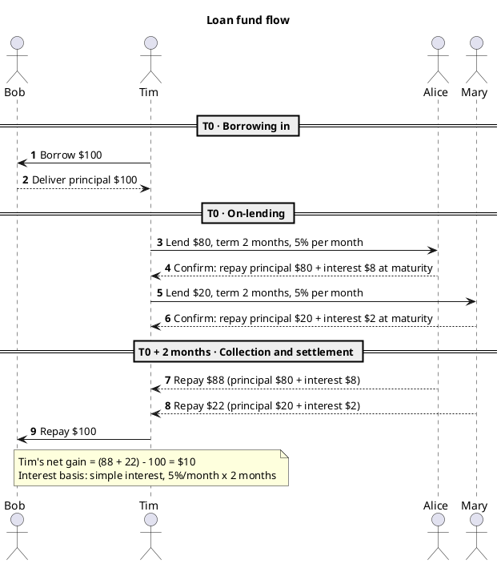

# PlantUML Sequence Diagrammer

A sequence diagram answers exactly one question: **in what order do messages travel, and between whom**. PlantUML describes it in text, so the diagram goes into Git and can be reviewed.

## Decide the mode first

- **Mode A: natural language -> sequence diagram.** The user told a business story (a loan, an order, an approval flow). Default mode.
- **Mode B: file -> sequence diagram.** The user gave a file path or a codebase and wants the call sequence reconstructed. Read the files first, then draw.
- **Mode C: teaching mode.** The user says "I'm new to this", "teach me", "step by step". Follow the outline below; do not just drop a diagram.

## Universal output requirements

Whichever mode is in play, the `.puml` you produce must satisfy these. They are what make a diagram *understandable* rather than merely *renderable*:

- The file **must** start with `@startuml` and end with `@enduml`. This is the most common error, and the most commonly forgotten.
- Put a `title` at the top stating which business process the diagram describes.
- Declare participants as `participant <short> as "<display>"`. **Always quote a display name containing spaces or special characters**, otherwise PlantUML parses them as syntax.
- The **declaration order is the left-to-right order of the lifelines**. Declare them in the order the events occur, so the diagram reads naturally.
- Turn on `autonumber`. In a review you can then say "step 7" instead of describing a position.
- Use `== Stage name ==` to divide the timeline, cutting long flows into readable segments.
- `->` is a request; `-->` is a return / response. Mixing them up leaves the reader unable to tell a call from a reply.
- Break long text with `\n`; anything inside quotes is fine.
- File name: `<index>_<topic>.puml`, for example `01_fund_flow.puml`, so files sort in reading order.

## Mode A: natural language -> sequence diagram

### Extract four things

1. **Participants**: which parties are in the story? Keep "roles" and "systems" apart -- `Customer` is a person, `Core System` is a system, and a sequence diagram should not conflate them.
2. **Messages**: every "did something" is a message; work out the direction (A to B, or B to A).
3. **Time progression**: mark time points with `== ==` or `...`. A "two months later" in the story must land on the diagram, or the temporal relationship is lost.
4. **Exceptions and alternative paths**: could it fail, time out, be rejected? Draw them with `alt` / `opt`.

### Example: loan flow

Input: "Tim borrowed $100 from Bob. Tim lent $80 of it to Alice and $20 to Mary, for 2 months at 5% per month. Two months later Tim returned $100 to Bob."



Two things are happening here. **The interest amounts implied by the source are calculated and placed on the messages** -- the source gave only a rate, leaving the reader to do the arithmetic, and the diagram is not actually clear until the amounts are on the page. And **a note records the interest-basis assumption**. Under compound interest the amounts would be $88.20 and $22.05, which is exactly what the user must confirm; do not silently pick one.

### Writing common branches

```plantuml
alt Validation passed
    Server --> Client : 200 OK
else Validation failed
    Server --> Client : 401 Unauthorized
end

opt No response within 3 seconds
    Client -> Client : Raise timeout notice
end

loop Retry up to 3 times
    Client -> Server : Resend request
end

group Idempotent handling
    Server -> Server : Deduplicate by requestId
end
```

Which to choose: `alt` is an exclusive branch, `opt` an optional add-on, `loop` a loop, and `group` is purely visual grouping that changes no semantics. Do not use `group` as a condition.

## Mode B: file -> sequence diagram

1. **Locate the entry point first.** Find `main`, route registration, `@RestController` / view functions, handlers -- a sequence diagram always starts at an external trigger.
2. **Read down the call chain.** Stop at downstream services / repositories / external interfaces. Do not read all the way to the bottom; stop at **boundaries that carry business meaning** (database, third-party API, message queue).
3. **Mark synchronous versus asynchronous.** Use `->` for synchronous calls; asynchronous messages can use `->>` with an explanatory note. Draw timeouts and retries with `alt` / `loop`.
4. **One diagram, one main path.** If you find five or six unrelated branches, split them into several `.puml` files ordered by an index prefix.

When reading files, read only the key nodes. Do not load an entire repository into context -- it is slow and it blurs the focus.

## Mode C: teaching mode

Work through in order, giving runnable code and a visible render at each step:

1. **Minimal runnable diagram** -- `@startuml` + one `participant` + one message + `@enduml`
2. **Participant types** -- `actor` (a person), `participant` (default), `boundary` / `control` / `entity` (fits layered architectures)
3. **Message types** -- `->`, `-->`, `->>` (async), `-x` (lost), and the reverse-direction forms
4. **Lifelines and activation** -- `activate` / `deactivate`, or the `++` / `--` shorthand, to show who is working during a period
5. **Notes** -- `note left/right/over`, used for business rules
6. **Grouping and branches** -- `alt` / `opt` / `loop` / `group` / `par`
7. **Styling and themes** -- `skinparam` and `!theme`
8. **Time progression** -- the difference between `== ==` and `...`

Call out the three beginner traps: **reversed arrow direction** (`A <- B` and `A --> B` mean different things), **a missing `@enduml`**, and **unquoted participant names containing spaces**.

## Windows installation

1. **Java** -- install JDK 17 or later (Temurin or Oracle, either is fine), then confirm with `java -version`.
2. **Graphviz** -- required when PlantUML draws non-sequence diagrams (class, component). Add its `bin` directory to `PATH` and confirm with `dot -V`. **Do not install it under a path containing spaces**; spaces cause a pile of trouble.
3. **VS Code** -- install `PlantUML` (extension ID `jebbs.plantuml`), open a `.puml` file and press `Alt+D` to preview. If you see `Dot executable does not exist`, Graphviz is missing or not on `PATH`: set `plantuml.dotPath` in the settings, or add `-Dplantuml.graphviz.dot=<full path to dot>` to `plantuml.commandArgs`.
4. **IntelliJ IDEA** -- install the `PlantUML integration` plugin; Graphviz must be configured first.
5. **Eclipse** -- install the PlantUML Eclipse Plugin (which carries its own Graphviz dependency).
6. **Zero-install fallback** -- the online editor <https://www.plantuml.com/plantuml/uml/> renders whatever you paste into it.

## Troubleshooting checklist

| Symptom | Cause and fix |
|---|---|
| `Dot executable does not exist` | Graphviz not installed / not on `PATH` / installed under a path containing spaces. Point the plugin settings explicitly at `dot` |
| Non-Latin text renders as boxes | Add `skinparam defaultFontName "Microsoft YaHei"` (or `"SimSun"`) and raise `skinparam defaultFontSize` |
| `Syntax Error?` | Missing `@enduml`; an unquoted participant name containing spaces; invalid arrow syntax (`<--` is easily confused with `-->`) |
| Image is clipped, content runs off the edge | Add `scale max 2000 width`, or adjust `plantuml.previewAutoUpdate` / preview panel zoom in VS Code |
| Large diagrams render extremely slowly | Add `!pragma layout smetana` (the Smetana layout engine, faster on large diagrams), or tighten styling with `skinparam style strictuml` |
| Preview does not refresh after an edit | The VS Code PlantUML preview lags by default; reopen it with `Alt+D`, or adjust `plantuml.previewAutoUpdate` |

## Last step

If the user gave only a topic ("draw a sequence diagram of a client and a server") with no detail, **do not invent interface names and fields**. Ask three things first: which participants there are, the message order on the happy path, and whether timeout / failure / retry branches are needed. Getting those answers first is far faster than drawing a version and then reworking it.
